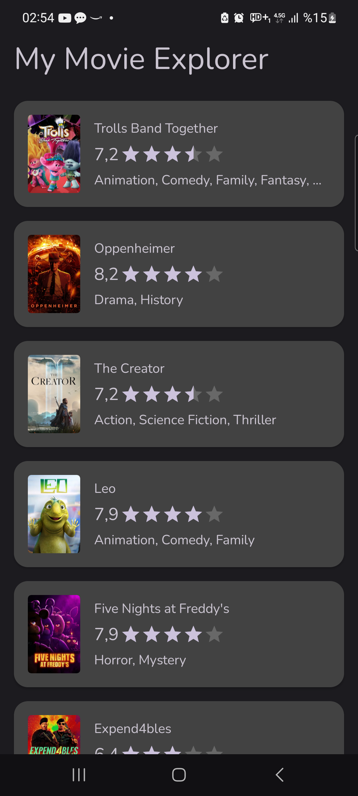
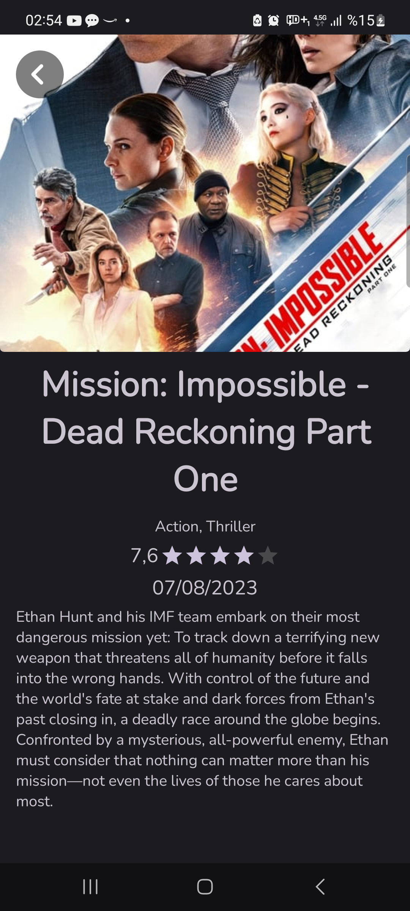

<h1 align="center">My Movie Explorer</h1>

  
Bu Kotlin tabanlı Android uygulaması, The Movie Database'in güçlü web servislerini kullanarak film dünyasını keşfetmenizi sağlar. MVVM mimarisiyle geliştirilen uygulama, Material Design prensiplerine uygun kullanıcı dostu bir arayüz sunar. Farklı ekran boyutlarına uyumlu tasarlanan ekran düzenleri, her cihazda sorunsuz bir görüntüleme deneyimi sunar. Detayları keşfedin, filmleri listeleyin ve sinema deneyiminizi zenginleştirin!

  
   

## How to?
**gradle.properties** dosyasının içinde The Movie DB token'i bulunmaktadır. Ağ çağrılarında bir sorun yaşarsanız, yeni bir token oluşturun ve **gradle.properties** dosyasının içindeki **AUTH_VALUE** değişkenine atayın.

## Tech Stack
- %100 Kotlin
- [Hilt](https://developer.android.com/training/dependency-injection) Dependency Injection library in Android
- [Coroutines](https://kotlinlang.org/docs/coroutines-overview.html) Async programming
- [ViewModel & LiveData]()
- [Coil](https://github.com/coil-kt/coil) Image loading library
- [View Binding Delegate](https://github.com/hoc081098/ViewBindingDelegate) One line binding
- [Navigation]() Fragment'lar arası geçiş, storyboard yapısı
- [Retrofit]() Network Kütüphanesi

## Screenshots
 
